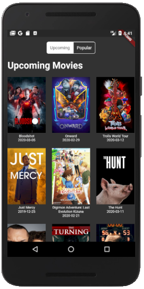
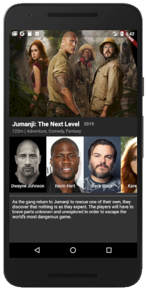

# The Movie App Open Source

Esse projeto foi desenvolvido com o <a href="https://github.com/Flutterando/modular" target="_blank">Modular</a>, tendo o <a href="https://medium.com/flutter-comunidade-br/flutter-com-mobx-c0f4762fbd1a" target="_blank">MobX</a> como gerenciador de estado e o <a href="https://github.com/Flutterando/slidy" target="_blank">Slidy</a> como CLI.

Para padronização de commits, foi utilizado o conceito de <a href="https://www.conventionalcommits.org/en/v1.0.0/" target="_blank">Conventional Commits</a>

Link da API que foi usada no projeto: https://www.themoviedb.org/

## Screenshots

  <video width="320" height="240" controls>
    <source src="assets/the-movie-adb-open-source.mp4" type="video/mp4">
  </video>
  
   

## Flutter

- <a href="https://flutter.dev/" target="_blank">Flutter.dev</a>
